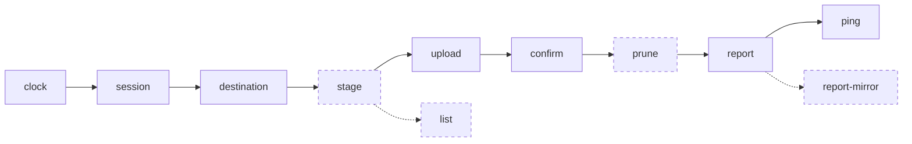

<p align="center">
  <a href="https://github.com/katoptra">
    <picture>
      <source media="(prefers-color-scheme: dark)" srcset="https://katoptra.org/brand/katoptra-mark-dark-224.png">
      
    </picture>
  </a>
</p>

<h1 align="center">github</h1>

<p align="center">A nightly mirror of GitHub repositories into Proton Drive, one bundle each.</p>

<p align="center">
  <a href="https://github.com/katoptra/github/actions/workflows/sync.yml"></a>
  <a href="LICENSE"></a>
  <a href="https://github.com/katoptra/github/actions/workflows/sync.yml"></a>
</p>

A nightly mirror of every repository under the GitHub owners it names into one Proton
Drive folder. Each repository becomes one git bundle, `<owner>/<name>.bundle`: a mirror
clone's every ref, branches, tags and pull-request heads, in one file that `git clone`
restores. A repository that did not change uploads nothing, because its bundle's bytes
are the same and Proton's CLI skips a file whose content it already holds; one that
changed becomes a new revision, and Proton's version history is the history of the
mirror. Nothing is kept between runs but the Proton CLI session, encrypted in a bucket.

The repository is public and holds no account: every credential and every account
identifier lives in one vault and reaches a run by name.

## How to use

A bundle is a repository. To get one back:

```sh
git clone owner/name.bundle name        # every branch, tag and pull-request head
git -C name remote set-url origin https://github.com/owner/name.git
git bundle list-heads owner/name.bundle # what it carries, without cloning
```

Last night's copy is the current revision in Proton Drive; earlier nights are its
version history, as many as the plan keeps. A repository that left GitHub is in Proton's
trash under its old name, and a renamed one is trashed under the old name and uploaded
under the new.

## How it works

Once a night a GitHub Actions job runs this pipeline inside the toolbox image from
[katoptra/lib](https://github.com/katoptra/lib). Every solid box is a verb of lib's
proton engine; the dashed ones are this mirror's own.



What this mirror owns, in [`Taskfile.yml`](Taskfile.yml):

- **Its identity**, in root vars: `OWNERS`, the GitHub users or organizations to mirror,
  and `LIST_FLOOR`, the count under which a listing is refused, so a broken token can
  never turn an empty listing into a trash list.
- **`stage`**, the engine's hook for filling the staging tree. It runs `list`, which asks
  the API for every repository under each owner with that owner's token and refuses a
  listing that names another owner's repositories, then clones each as a mirror, bundles
  it with `git bundle create --all`, and deletes the clone.
- **`prune`**, the engine's hook for what upstream dropped: list each owner's folder in
  Proton and trash the bundles whose repository is no longer listed.
- **Its rows of the run summary**, and `offline`, which bundles a throwaway repository
  twice inside the image and compares: the skip rests on bundles being byte-for-byte
  reproducible for an unchanged repository.

The session, the destination check, the one-call upload and its confirmation are the
engine's and are documented once in
[lib's README](https://github.com/katoptra/lib#the-proton-engine).

## Want your own?

### 1. Fork it

Fork [katoptra/github](https://github.com/katoptra/github). One line of `Taskfile.yml` is
yours to change, `OWNERS`; each owner needs a token line in `op.env` named
`MIRROR_GITHUB_TOKEN_<OWNER>`. Set `LIST_FLOOR` to about half the repositories you have.

### 2. Storage

The bucket holds one object, the encrypted Proton CLI session, under `.state/`. Proton
holds the mirror.

| What | Why |
|---|---|
| An R2 bucket, or any S3-compatible bucket | The session |
| An API token with Object Read & Write, scoped to that bucket | The `r2` values in step 3 |

What the engine keeps in a bucket and why the session gets no history:
[lib, Storage](https://github.com/katoptra/lib#storage).

### 3. Secrets

Ten values, in one vault item named `github`, one section per service:

| Section | Field | What it is | Reaches the run as |
|---|---|---|---|
| `github` | `token_<owner>`, one per owner | A fine-grained token, step 4 | `MIRROR_GITHUB_TOKEN_<OWNER>` |
| `proton` | `destination` | The CLI path of the folder, `/my-files/GitHub` | `MIRROR_PROTON_DESTINATION` |
| `proton` | `destination_uid` | That folder's UID | `MIRROR_PROTON_DESTINATION_UID` |
| `r2` | `access_key_id`, `secret_access_key` | The token from step 2 | `AWS_ACCESS_KEY_ID`, `AWS_SECRET_ACCESS_KEY` |
| `r2` | `endpoint` | `https://<account-id>.r2.cloudflarestorage.com` | `AWS_ENDPOINT_URL_S3` |
| `r2` | `bucket` | The bucket's name | `MIRROR_R2_BUCKET` |
| `age` | `identity` | An `AGE-SECRET-KEY-...` line from `age-keygen` | `MIRROR_AGE_IDENTITY` |
| `healthcheck` | `url` | Optional: a healthchecks.io ping URL | `HEALTHCHECK_URL` |

Put your vault's UUID into the references in [`op.env`](op.env), make a service account
that can read that vault, and store its token as the `OP_SERVICE_ACCOUNT_TOKEN` secret,
on the organization or on the repository. Finding a vault's UUID and why a UUID and not
a name: [lib, Secrets](https://github.com/katoptra/lib#secrets).

### 4. GitHub and Proton

**Tokens.** One fine-grained personal access token per owner, since a fine-grained token
has exactly one resource owner: for all repositories, with `Contents: read` and
`Metadata: read` and nothing else. The mirror can never write to GitHub. Store each as
the `token_<owner>` field of section `github`.

**The session.** The Proton CLI can only be seeded by a browser sign-in, so the session
is made once on a laptop and carried to every run encrypted; the commands, the folder and
its UID, and `task session-seal -- .run/pd` are in
[lib, The session](https://github.com/katoptra/lib#the-session). Store the folder's CLI
path as `destination` and its `uid` from the listing as `destination_uid`. This mirror's
session is its own: two mirrors sharing one race its rotating refresh token.

### 5. Prove it, run it, schedule it

On a laptop with go-task, the 1Password CLI and Docker or Apple `container`:

```sh
task check                  # every pipeline command rendered inside the image, diffed against render.txt
task run -- task offline    # the bundle reproducibility check; no network
task plan                   # the real thing, read-only: session, destination, list, clone and bundle; nothing uploaded
```

Then Actions, sync, Run workflow. The first run uploads every bundle; a quiet night
afterwards uploads none. Nothing in this repository schedules a run: add a `schedule:`
trigger to `.github/workflows/sync.yml`, or dispatch it from outside as this mirror is.

## Operating it

`task` alone prints the menu. Everything runs inside the toolbox.

```sh
task sync                       # one run, the same thing Actions runs
task plan                       # read-only: list, clone and bundle; prints what an upload would carry
task session-seal -- .run/pd    # encrypt a laptop Proton CLI session into the bucket
task empty-trash                # permanently delete Proton's trash; asks first; never scheduled
```

Never run `task sync` or `task plan` from a laptop while an Actions run may be in
progress: both hold the one Proton session, and the loser of a race needs a fresh login.

Every run appends one table to its job page: when it started, the files and MB staged,
what Proton reported (uploaded, skipped as identical, failed), whether the session was
restored, repositories listed and bundled, bundles pruned. A quiet night reads "0
uploaded, N skipped as identical", N being the bundles plus their owner folders. A failed
run is the only alert: healthchecks.io emails when a night passes without a ping.

On a public repository the run logs are public. They carry counts and never a repository
name, a path in Proton, a token or an account identifier: git's stderr goes to a file, a
failure names a repository by its position in the listing, and the CLI's stderr goes to
`.run/pd.err`.

- **The run fails at `session`.** The session is gone or its token was rotated out from
  under it. Sign in again on a laptop and `task session-seal -- .run/pd`.
- **`destination` refuses the run.** The folder is not a direct child of its parent, or
  its UID differs from the vault's. List the parent with `filesystem list -j` and fix the
  field or the folder.
- **`list` refuses a listing.** Under `LIST_FLOOR`, or the token listed another owner's
  repositories: a wrong or expired token. Nothing was trashed.
- **`confirm` fails.** Proton's summary did not account for every staged file. The next
  night retries everything, which costs nothing for what already landed.

## Reference

Issues, pull-request discussion, release notes and attachments are not in git and
GitHub's migration export API is closed to ordinary accounts, so they are not here. A
wiki would be one more clone each; no repository under either owner has one today.

Pull requests are welcome.

MIT licensed. Built by [Josh Vaughen](https://ijosh.com).
