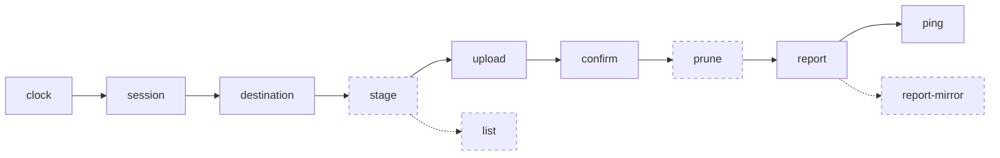

<p align="center">
  <a href="https://github.com/katoptra">
    <picture>
      <source media="(prefers-color-scheme: dark)" srcset="https://katoptra.org/brand/katoptra-mark-dark-224.png">
      
    </picture>
  </a>
</p>

<h1 align="center">github</h1>

<p align="center">A daily mirror of GitHub repositories into Proton Drive, one bundle for each repository.</p>

<p align="center">
  <a href="https://github.com/katoptra/github/actions/workflows/sync.yml"></a>
  <a href="LICENSE"></a>
  <a href="https://github.com/katoptra/github/actions/workflows/sync.yml"></a>
</p>

This mirror copies each repository of the GitHub owners in `OWNERS` into one Proton Drive
folder, daily. Each repository becomes one git bundle, `<owner>/<name>.bundle`. A bundle is
one file with all the refs of a mirror clone (the branches, the tags and the pull-request
heads). `git clone` makes the repository again from that file.

If a repository did not change, its bundle has the same bytes as the bundle of the last run.
The Proton CLI does not upload a file that is the same as the file in Proton Drive. Thus, the
run uploads no file for that repository. If a repository changed, its bundle becomes a new
revision. Thus, the version history in Proton Drive is the history of the mirror.

Between runs, the mirror keeps only the encrypted session of the Proton CLI in a bucket.

This is a public repository. It contains no credential and no account identifier. These are
in one vault. A run uses the name of each value to get it.

## How to use

A bundle is a repository. Use these commands to get a repository from its bundle:

```sh
git clone owner/name.bundle name        # every branch, tag and pull-request head
git -C name remote set-url origin https://github.com/owner/name.git
git bundle list-heads owner/name.bundle # what it carries, without cloning
```

The copy from the last run is the newest revision in Proton Drive. The copies from the
previous runs are its version history. The Proton plan has a limit on the number of
revisions.

If the listing from GitHub does not contain a repository, the mirror moves its bundle to the
trash in Proton Drive. If a repository gets a new name, the mirror uploads a bundle with the
new name. Then it moves the bundle with the previous name to the trash.

## How it works

A GitHub Actions job operates this pipeline daily, in the toolbox image of
[katoptra/lib](https://github.com/katoptra/lib). In the diagram, each dashed box is a verb of
this mirror. Each other box is a verb of the toolbox or of the proton engine of lib.


```mermaid
flowchart LR
  clock --> session --> destination --> stage --> upload --> confirm --> prune --> report --> ping
  stage -.-> list["list"]
  report -.-> rm["report-mirror"]
  classDef own stroke-dasharray: 5 5
  class stage,list,prune,rm own
```

[`Taskfile.yml`](Taskfile.yml) contains the parts of this mirror:

- **Root vars.** Root vars hold only the values of this mirror. Do not put an engine default
  in a root var, because then the command line cannot set it
  ([lib README, Rules a mirror keeps](https://github.com/katoptra/lib#rules-a-mirror-keeps)).
  `API`, `CURL` and `ACCEPT` are only for `list`. This mirror has two more root vars:
  - `OWNERS` gives the GitHub users or organizations that the mirror copies.
  - `LIST_FLOOR` is the minimum number of repositories in a listing. `list` rejects a
    listing that has less than `LIST_FLOOR` repositories. Thus, the empty listing of an
    incorrect token cannot cause `prune` to move bundles to the trash. But the `vars` input
    of `sync.yml` can set `LIST_FLOOR` and `OWNERS` for `list` and `prune`, and
    `LIST_FLOOR=0` there removes this guard.
- **`stage`** is the hook of the engine that fills the staging tree. First, it runs `list`.
  `list` gets each repository of each owner from the API, with the token of that owner. It
  rejects a listing that contains a repository of a different owner. Then `stage` does
  these steps for each repository:
  1. It clones the repository as a mirror.
  2. It makes a bundle of the clone with `git bundle create --all`.
  3. It deletes the clone.
- **`prune`** is the hook of the engine for the repositories that upstream does not have.
  It gets the listing of the folder of each owner in Proton Drive. Then it moves a bundle to
  the trash if the listing from GitHub does not contain its repository.
- **`report-mirror`** adds the rows of this mirror to the run summary.
- **`offline`** makes two bundles of a test repository in the image, and compares them. A
  repository that did not change must give the same bundle, byte for byte. If the bundle
  changes, the upload sends it again at each run.

The engine has these verbs:

- The session
- The destination check
- The upload in one CLI call
- The check of the upload.

Only [lib's README](https://github.com/katoptra/lib#the-proton-engine) tells how they operate.

## Want your own?

### 1. Fork it

Fork [katoptra/github](https://github.com/katoptra/github). Then set two root vars in
`Taskfile.yml`:

- Set `OWNERS` to your GitHub users and organizations.
- Set `LIST_FLOOR` to approximately half the number of your repositories.

For each owner, add a token line to `op.env`, with the name `MIRROR_GITHUB_TOKEN_<OWNER>`.

### 2. Storage

The bucket contains one object: the encrypted session of the Proton CLI, in `.state/`.
Proton Drive contains the mirror.

| Item | Function |
|---|---|
| An R2 bucket, or a bucket of a different S3-compatible service | It contains the session |
| An API token with Object Read & Write, for that bucket only | It gives the `r2` values in step 3 |

[lib, Storage](https://github.com/katoptra/lib#storage) gives the keys that the engine keeps
in a bucket. [lib, The session](https://github.com/katoptra/lib#the-session) gives the cause
of a session without history.

### 3. Secrets

Put ten values (for two owners) in one vault item with the name `github`. Use one section
for each service:

| Section | Field | Value | Name in the run |
|---|---|---|---|
| `github` | `token_<owner>`, one for each owner | A fine-grained token, step 4 | `MIRROR_GITHUB_TOKEN_<OWNER>` |
| `proton` | `destination` | The CLI path of the folder, `/my-files/GitHub` | `MIRROR_PROTON_DESTINATION` |
| `proton` | `destination_uid` | The UID of that folder | `MIRROR_PROTON_DESTINATION_UID` |
| `r2` | `access_key_id`, `secret_access_key` | The token from step 2 | `AWS_ACCESS_KEY_ID`, `AWS_SECRET_ACCESS_KEY` |
| `r2` | `endpoint` | `https://<account-id>.r2.cloudflarestorage.com` | `AWS_ENDPOINT_URL_S3` |
| `r2` | `bucket` | The name of the bucket | `MIRROR_R2_BUCKET` |
| `age` | `identity` | An `AGE-SECRET-KEY-...` line from `age-keygen` | `MIRROR_AGE_IDENTITY` |
| `healthcheck` | `url` | Optional: a healthchecks.io ping URL | `HEALTHCHECK_URL` |

Put the UUID of your vault in the references in [`op.env`](op.env). Make a service account
that can read that vault. Put its token in the `OP_SERVICE_ACCOUNT_TOKEN` secret, on the
organization or on the repository.

Each reference uses the UUID of the vault, not its name.
[lib, Secrets](https://github.com/katoptra/lib#secrets) tells how to find the UUID, and gives
the cause of this rule.

### 4. GitHub and Proton

**Tokens.** Make one fine-grained personal access token for each owner. A fine-grained token
has only one resource owner. Give each token access to all repositories, with
`Contents: read`, `Metadata: read` and no other permission. Thus, the mirror cannot write to
GitHub. Put each token in the field `token_<owner>` of the section `github`.

**The session.** Only a sign-in in a browser can make a session for the Proton CLI. Make the
session one time, on a laptop. Then each run gets the encrypted session from the bucket.
[lib, The session](https://github.com/katoptra/lib#the-session) gives:

- The commands
- How to make the folder and find its UID
- `task session-seal -- .run/pd`.

Put the CLI path of the folder in the field `destination`. Put the `uid` of the folder from
the listing in the field `destination_uid`. This mirror has a session that no other mirror
uses.

### 5. Do the checks, run it, schedule it

Use a laptop with these tools:

- go-task
- The 1Password CLI
- Docker or Apple `container`.

Run these commands:

```sh
task check                  # every pipeline command rendered inside the image, diffed against render.txt
task run -- task offline    # the bundle reproducibility check; no network
task plan                   # the real thing, read-only: session, destination, list, clone and bundle; nothing uploaded
```

Pause the healthcheck before the first run. Then, in Actions, open the sync workflow. Click
**Run workflow**. The first run uploads each bundle. After that, a run uploads no bundle if no
repository changed.

No part of this repository starts a run. To schedule runs, add a `schedule:` trigger to
`.github/workflows/sync.yml`. Or dispatch the workflow from an external scheduler. This mirror
uses an external scheduler.

## Operating it

`task` without a task name prints the menu. Each task operates in the toolbox.

```sh
task sync                       # one run, the same thing Actions runs
task plan                       # read-only: list, clone and bundle; prints what an upload would carry
task session-seal -- .run/pd    # encrypt a laptop Proton CLI session into the bucket
task empty-trash                # permanently delete Proton's trash; asks first; never scheduled
gh workflow run sync.yml        # one run in Actions
```

Do not run `task sync`, `task plan` or `task empty-trash` on a laptop while an Actions run can
be in progress. The two runs use one session, and then a new login can be necessary
([lib, The session](https://github.com/katoptra/lib#the-session)).

Each run adds one table to its job page, with these rows:

- The start of the run
- The image
- The next run
- The files and the MB in the staging tree
- The result from Proton: "uploaded", "skipped as identical" and "failed"
- The session: "restored" or "not restored"
- The repositories in the listing, and the bundles that the run made
- The bundles that the run moved to the trash.

After a run with no change, the Proton row shows "0 uploaded" and "N skipped as identical".
N is the number of bundles plus the number of owner folders.

A run failure is the only alert: if a day has no ping, healthchecks.io sends an e-mail.

Each person can read the run logs:
[lib, Monitoring](https://github.com/katoptra/lib#monitoring) gives the data that a run writes
to them.

If a run has a problem, find it in this list:

- **The run stops at `session`.** The bucket has no session, or a different process changed
  the token of the session. Make a new session on a laptop. Then run
  `task session-seal -- .run/pd`.
- **`destination` stops the run.** The folder is not directly in its parent folder, or its
  UID is different from the UID in the vault. Get the listing of the parent folder with
  `filesystem list -j`. Then correct the field or the folder.
- **`list` rejects a listing.** The listing has less than `LIST_FLOOR` repositories, or it
  contains a repository of a different owner. The cause is an incorrect token or an expired
  token. The run moved no bundle to the trash.
- **`confirm` stops the run.** The summary from Proton does not include each staged file.
  The next run tries all the bundles again. The CLI does not send a bundle again if Proton
  Drive has the same file.
- **The run did not start.** No part of this repository starts a run. Examine the scheduler
  ([katoptra/dispatch](https://github.com/katoptra/dispatch#when-something-goes-wrong)).
  Then run `gh workflow list --all` to find if a person disabled the workflow. A disabled
  workflow shows `disabled_manually`, not `active`. Until you correct the cause, start runs
  with `gh workflow run sync.yml`.

## Reference

These items are not in git:

- Issues
- The comments on pull requests
- Release notes
- Attached files.

GitHub does not let usual accounts use its migration export API. Thus, this mirror does not
contain these items.

The mirror does not copy wikis. Each wiki is one more clone for its repository. No
repository of the two owners has a wiki.

Pull requests are welcome.

MIT licensed. Built by [Josh Vaughen](https://ijosh.com).
